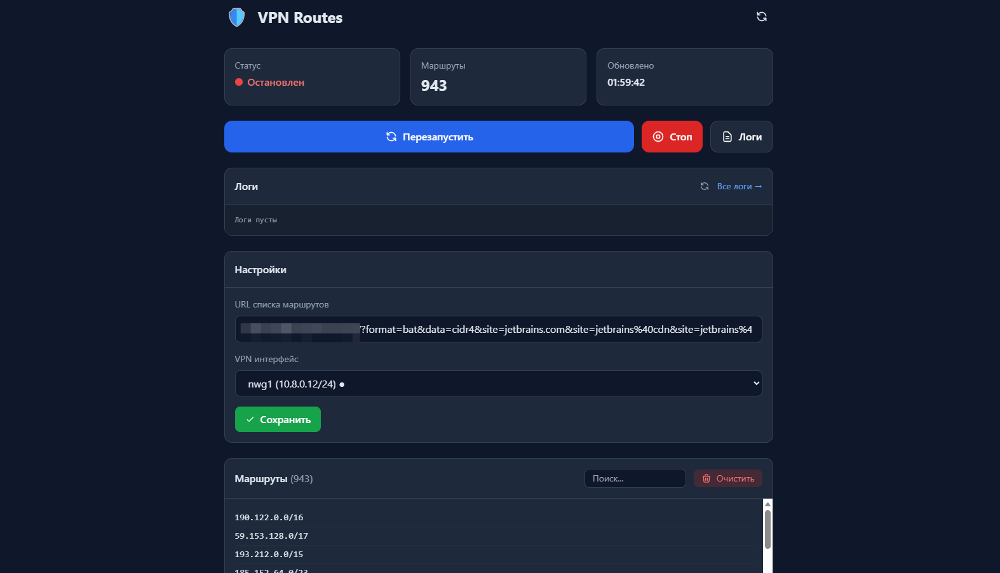

# KeenRoute

Селективная VPN-маршрутизация для роутеров Keenetic с Entware.

Автоматически направляет трафик к выбранным сервисам (WhatsApp, Telegram и др.) через VPN-интерфейс, используя ipset + policy routing. Остальной трафик идёт напрямую.

<p align="center">
  
</p>

## Возможности

- Загрузка списков IP-адресов из внешнего источника (iplist.opencck.org)
- Конвертация форматов (Windows BAT -> CIDR)
- Маршрутизация через ipset + iptables + ip rule (O(1) lookup)
- Кэширование маршрутов на случай недоступности источника
- Автообновление по cron (ежедневно в 04:00)
- Автозапуск при старте роутера
- Веб-панель управления (опционально) на lighttpd + CGI

## Требования

- Роутер Keenetic с установленным Entware
- Настроенный VPN-интерфейс (WireGuard)

## Установка

```bash
# Скопировать файлы на роутер
scp -P 222 -r . root@192.168.1.1:/tmp/keen-route/

# Подключиться к роутеру
ssh -p 222 root@192.168.1.1

# Установить основной скрипт
cd /tmp/keen-route
./install.sh

# Установить веб-панель (опционально)
./install-dashboard.sh
```

## Настройка

После установки отредактируйте конфигурацию:

```bash
nano /opt/etc/vpn-routes/config.sh
```

### Плейсхолдеры, которые нужно заменить

| Плейсхолдер | Где находится | Что указать |
|---|---|---|
| `<VPN_INTERFACE>` | `opt/etc/vpn-routes/config.sh` | Имя VPN-интерфейса WireGuard (например, `nwg1`). Узнать: `ip link show \| grep nwg` |

### Основные параметры config.sh

| Параметр | Описание |
|---|---|
| `ROUTES_URL` | URL для загрузки списка маршрутов |
| `VPN_INTERFACE` | Имя VPN-интерфейса WireGuard |
| `IPSET_NAME` | Имя ipset (по умолчанию `vpn_routes`) |
| `FWMARK` | Метка для маркировки пакетов (по умолчанию `0x1`) |
| `ROUTE_TABLE` | Номер таблицы маршрутизации (по умолчанию `100`) |
| `LOG_RETENTION_DAYS` | Хранить логи за N дней (по умолчанию `7`) |
| `VERBOSE` | Подробное логирование: `1` — да, `0` — нет |

## Использование

```bash
# Запуск
/opt/bin/vpn-routes.sh start

# Остановка
/opt/bin/vpn-routes.sh stop

# Перезапуск
/opt/bin/vpn-routes.sh restart

# Обновить маршруты вручную
/opt/bin/vpn-routes.sh update

# Проверить статус
/opt/bin/vpn-routes.sh status
```

## Веб-панель

После установки доступна по адресу `http://<IP_РОУТЕРА>:8080`.

```bash
/opt/etc/init.d/S80vpn-routes-web start|stop|restart|status
```

## Удаление

```bash
./uninstall.sh
```
